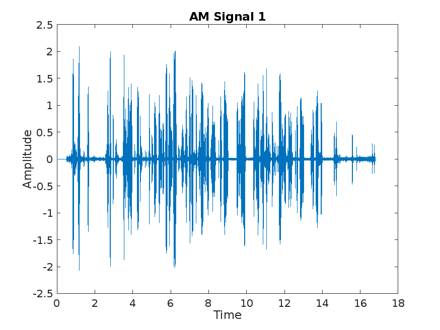
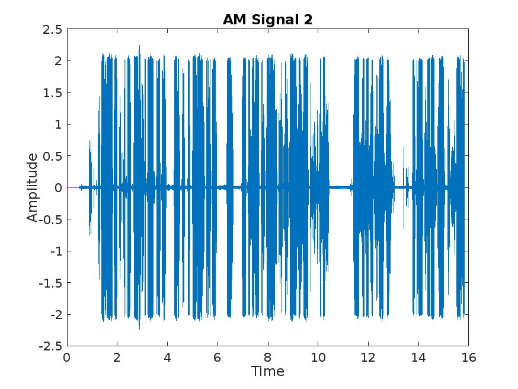
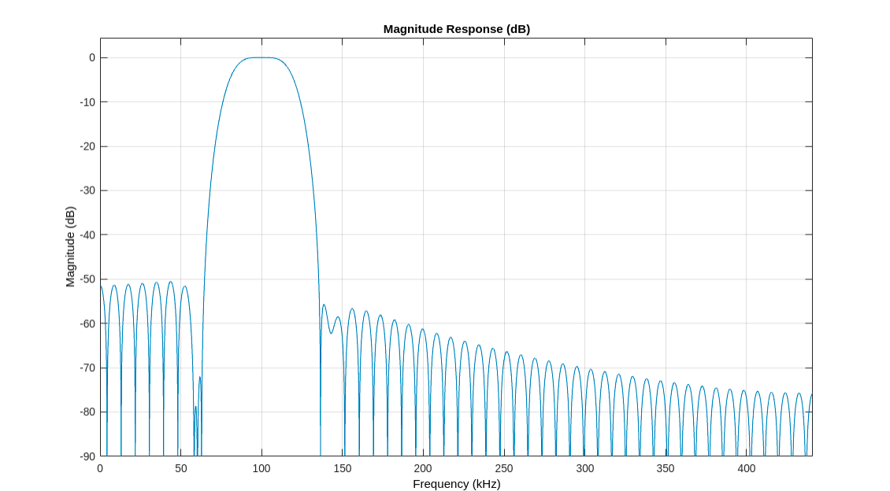
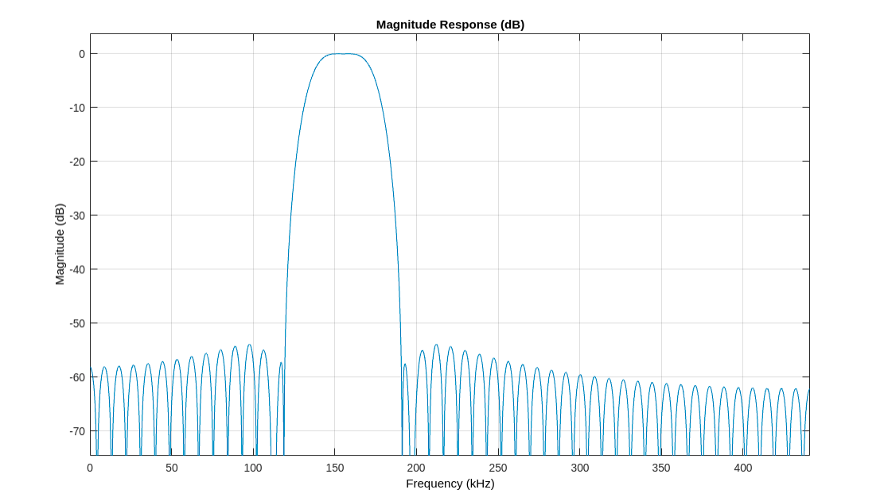
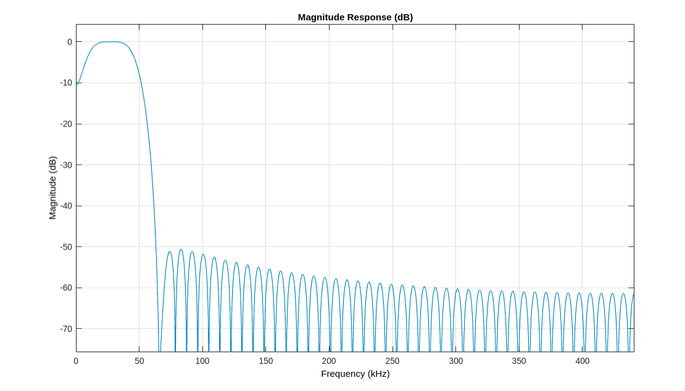
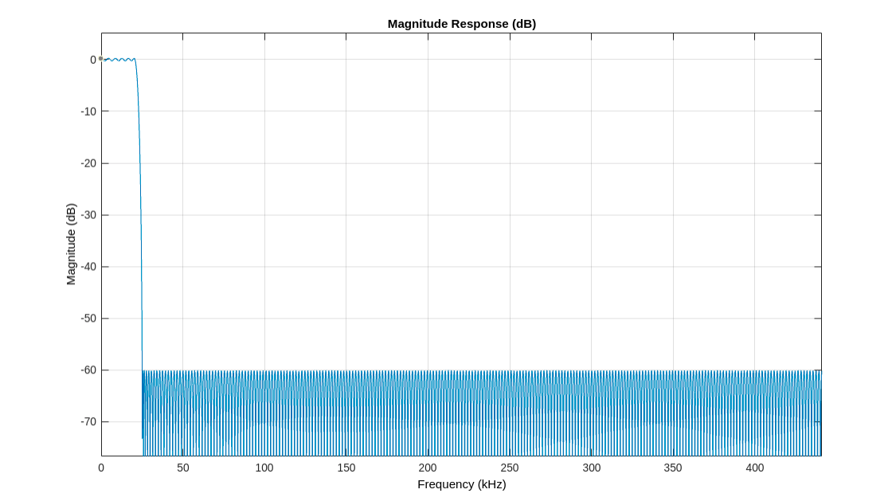
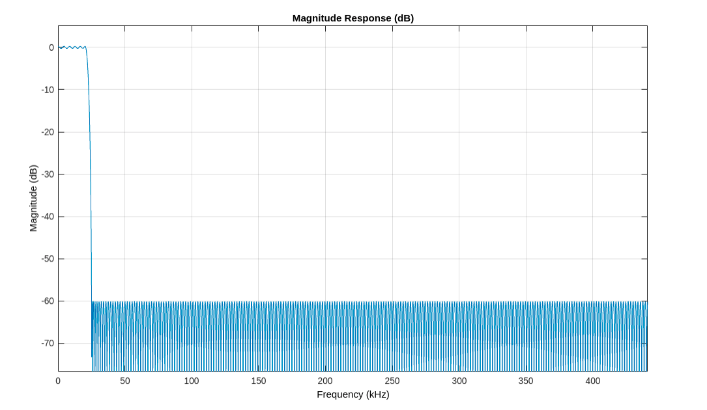

# Super-heterodyne Receiver

simulateing an AM modulator and a corresponding super-heterodyne receiver using radio-station generated signals.

## Introduction

This MATLAB code demonstrates the amplitude modulation (AM) signal processing pipeline for a set of modulating signals. The code processes both "Short_BBCArabic2.wav" and "Short_FM9090.wav" signals, providing insights into the various stages of AM signal generation, filtering, and analysis.

## Code Structure

The code is structured into several sections, each serving a specific purpose in the AM signal processing pipeline. The main sections include:

- Modulating Signal Processing:
  - Read two modulating signals: "Short_BBCArabic2.wav" and "Short_FM9090.wav."
  - Convert stereo signals to single-channel streams.
  - Compute the FFT of each modulating signal to determine the baseband bandwidth.
  - Upsample each signal and generate carrier signals.
  - Mix modulating signals with carrier signals to produce amplitude-modulated (AM) signals.

- Transmission
  - Combine the two AM signals.
  - Apply band-pass filtering to simulate transmission over a radio frequency (RF) channel.

- Reception
  - Generate an intermediate frequency (IF) stage carrier.
  - Mix the received signal with the IF carrier.
  - Apply band-pass filtering to isolate the IF signal.
  - Mix the IF signal with a suitable carrier signal to obtain the baseband signal.
  - Apply low-pass filtering to the baseband signal.

- Audio Export:
  - The processed baseband signals are exported as audio files (found in received directory).

## Results and Plots

For both signals -Short_BBCArabic2.wav represents signal 1, and Short_FM9090.wav represents signal 2- the following results and plots are generated:

- Modulating Signal Analysis

  - Frequency spectrum of the first modulating signal
  
      

  - Frequency spectrum of the second modulating signal

      

- Amplitude Modulation (AM) Signal Analysis:
  - Time-domain plot of the first amplitude-modulated (AM) signal.

      

  - Time-domain plot of the second amplitude-modulated (AM) signal.

      

  - Frequency spectrum of the first AM signal

      

  - Frequency spectrum of the second AM signal

      

- Transmitted Signal:
  - Frequency spectrum plot of the combined transmitted signal after AM modulation.

      

- RF Stage Signal Analysis

  - Frequency spectrum of the received RF signal after band-pass filtering for the first signal.

      

  - Visualization of the band-pass filter frequency for the first signal.

      

  - Frequency spectrum of the received RF signal after band-pass filtering for the second signal.

      

  - Visualization of the band-pass filter frequency for the first signal.

      

- IF Stage Signal Analysis

  - Frequency spectrum of the intermediate frequency (IF) signal for the first signal.

      

  - Frequency spectrum of the IF signal for the second signal.

      

  - Visualization of the band-pass filter frequency response for the IF signals

      

  - Frequency spectrum of the filtered IF signal for the first signal.

      

  - Frequency spectrum of the filtered IF signal for the second signal.

      

- Baseband Signal Analysis

  - Time-domain plot of the baseband signal for the first signal.

      

  - Time-domain plot of the baseband signal for the second signal.

      

  - Frequency spectrum of the filtered baseband signal for the first signal.

      

  - Visualization of the low-pass filter frequency response for the first signal.

      

  - Frequency spectrum of the filtered baseband signal for the second signal.

      

  - Visualization of the low-pass filter frequency response for the second signal.

      

## Instructions for Use

To use this code for other modulating signals:

- Update the modulating_signals list with the desired signal filenames.
- Adjust parameters such as filter orders, frequencies, and gains as needed.
